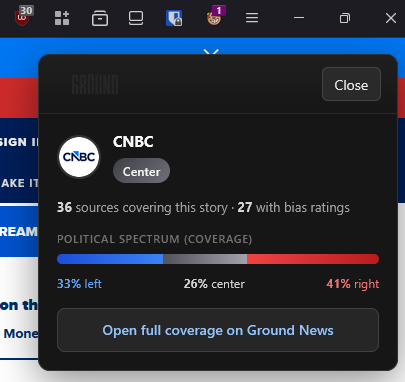

# Ground News Bias Userscript (Minimal)

Repository: [NickMarcha/ground-news-bias-script](https://github.com/NickMarcha/ground-news-bias-script)

Manual lookup userscript for Ground News data with minimal interference:
- No automatic overlay injection on page load.
- User-triggered lookup via userscript menu command.
- TypeScript source and GitHub Actions build pipeline.

## Preview



## Disclaimer

This project is maintained independently by its contributors. It has **no affiliation** with Ground News, its operators, or any related company or organization, and is **not** endorsed or sponsored by them. References to Ground News are for identification of the service the userscript interacts with only.

### For Ground News

If you represent Ground News and want this script or repository taken down—or have another concern about the project—please **open an issue** on this repository so maintainers can see it and respond.

## Install (Violentmonkey / Tampermonkey)

**One-click install from `main` (auto-updates when CI refreshes the file):**

[Install userscript (raw)](https://raw.githubusercontent.com/NickMarcha/ground-news-bias-script/main/published/install.user.js)

Or paste this URL into your manager’s “install from URL” field:

```
https://raw.githubusercontent.com/NickMarcha/ground-news-bias-script/main/published/install.user.js
```

Mirror path (same file): [`published/latest.user.js`](https://raw.githubusercontent.com/NickMarcha/ground-news-bias-script/main/published/latest.user.js)

Then open any article page and use the manager menu:

- **Ground News: Check Current Page**

## Firefox extension (toolbar popup + sidebar)

Source lives under [`extension/`](extension/). The built, loadable package is produced in `extension/dist/` (not committed to git).

- **Toolbar**: click the extension action to open a popup that looks up the **active tab’s URL** (no content scripts on arbitrary sites).
- **Sidebar**: open **View → Sidebar → Ground News** (wording may vary by Firefox locale). The panel refreshes when you switch tabs or when the active tab finishes loading.

### Local build

You **must** run the build at least once on your machine (or use the CI artifact zip): Firefox loads files from `extension/dist/`, which only exists after:

```bash
npm ci
npm run build:extension
```

Then in Firefox: `about:debugging` → **This Firefox** → **Load Temporary Add-on** → choose `extension/dist/manifest.json`. After changing extension code, run `npm run build:extension` again and use **Reload** on the temporary add-on.

If the popup or sidebar looks **blank**, the usual cause is Firefox MV3’s **default extension CSP**: it does not allow cross-origin `fetch()` or rich `innerHTML` with inline `style=""` attributes unless you declare a matching policy. This repo sets `content_security_policy.extension_pages` in [`extension/manifest.json`](extension/manifest.json) (including `connect-src` for Ground hosts and `style-src 'unsafe-inline'` for the panel markup).

If DevTools still reports **Quirks Mode**, confirm the **selected frame** is your `moz-extension://…/sidebar.html` document (not a parent chrome document). The HTML must start with `<!DOCTYPE html>` with no BOM; rebuild with `npm run build:extension` after pulling.

### AMO / CI signing

Workflow: [`.github/workflows/firefox-extension.yml`](.github/workflows/firefox-extension.yml)

- Always builds the extension and uploads an **unsigned zip** artifact (`firefox-extension-unsigned-zip`) for manual upload to [AMO](https://addons.mozilla.org/) when you are getting the first version listed.
- If you add repository secrets **`WEB_EXT_API_KEY`** and **`WEB_EXT_API_SECRET`** (from the Firefox Developer Hub API credentials used by [`web-ext sign`](https://extensionworkshop.com/documentation/develop/web-ext-command-reference/#web-ext-sign)), the same workflow will also run signing and upload a **signed `.xpi`** artifact. If those secrets are missing, the sign step exits successfully with a notice and does nothing else.

#### Add-on ID (`browser_specific_settings.gecko.id`)

- Set in [`extension/manifest.json`](extension/manifest.json) as **`browser_specific_settings.gecko.id`**.
- Firefox allows a stable **email-style applications ID** (`something@domain`) **or** a **braced GUID** (`{xxxxxxxx-xxxx-xxxx-xxxx-xxxxxxxxxxxx}`). This repo uses an email-style ID; that is valid for AMO and is **not** required to be a UUID.
- **Never change** the ID after the first public listing or AMO submission—updates are tied to that value. See Mozilla’s [Extensions and the add-on ID](https://extensionworkshop.com/documentation/develop/extensions-and-the-add-on-id/).
- If [Developer Hub](https://addons.mozilla.org/developers/) already shows a **specific GUID** for this add-on, replace `gecko.id` with that exact braced string **once**, then keep it forever.

Toolbar, sidebar, and `about:addons` icons are square **`icons/icon.svg`** under [`extension/public/icons/`](extension/public/icons/) (derived from [`assets/logo.svg`](assets/logo.svg)); the build copies `extension/public` into `extension/dist` and also bundles [`assets/`](assets/) into `extension/dist/assets/` when present.

## Development

Prerequisites:
- Node.js from `.nvmrc`

Install and build:

```bash
npm ci
npm run build
```

Output:
- `dist/userscript.user.js`

## GitHub Workflow

Userscript workflow:
- `.github/workflows/userscript.yml`

Behavior:
- Runs check + build on pushes and manual dispatch.
- Uploads build artifact.
- On `main`, copies build output into `published/latest.user.js` and `published/install.user.js` for easy install links without release tags.

---

## Roadmap and plan (what’s left)

### Done

- Confirmed lookup flow: `extension.ground.news/search` → IDs → `production.checkitt.news/.../toolbarData/...` (anonymous, no login required for basic bias/coverage).
- Userscript: menu-triggered lookup, results panel, TypeScript + CI.
- Shared lookup + panel HTML: [`src/lookupCore.ts`](src/lookupCore.ts), [`src/panelHtml.ts`](src/panelHtml.ts) (used by userscript and the Firefox extension).
- Firefox MV3: toolbar **popup** + **sidebar**, narrow `host_permissions`, explicit `content_security_policy` for Ground `fetch` / images / panel styles, no global page injection ([`extension/manifest.json`](extension/manifest.json)).
- CI: extension build + zip artifact; optional `web-ext sign` when API secrets exist.

### To do

- [ ] **First AMO submission** (manual): upload the unsigned zip from the `firefox-extension-unsigned-zip` artifact, then align `extension/manifest.json` gecko id / version with what AMO expects.
- [ ] **Turn on automated signing** after first listing: add `WEB_EXT_API_KEY` and `WEB_EXT_API_SECRET`; confirm signed artifact upload and update docs with install links if you distribute outside AMO.
- [ ] **Polish**: icons for the extension action, debounced sidebar refresh, optional `activeTab` vs `tabs` review.
- [ ] **Optional later**: login / save-article flows; not required for minimal lookup.

### To do — userscript polish (optional)

- [ ] Theming / dark–light follow system preference.
- [ ] Optional `@connect` / caching tweaks if Ground changes CORS or rate limits.
